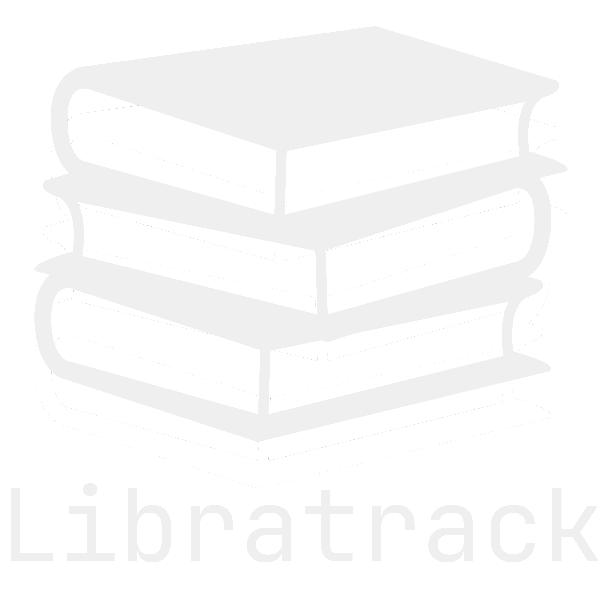

# Libratrack 📚

 {# Optional: Adjust path if needed #}

Libratrack is a web application designed to help users organize and manage their personal home libraries. Keep track of your books, arrange them onto virtual shelves, and easily find what you're looking for.

## Features ✨

* **User Authentication:** Secure user registration, login, and logout functionality.
* **Profile Management:** View and update user profile information (username, email) and profile picture.
* **Shelf Management (CRUD):**
    * Create, view, update, and delete virtual shelves.
    * Add optional descriptions and row/column dimensions to shelves.
* **Book Management (CRUD):**
    * Add books to specific shelves, including title, author, ISBN, description, cover image URL, and optional row/column position.
    * View detailed information for each book.
    * Update existing book details.
    * Delete books from shelves.
* **Homepage Dashboard:** View recently added books upon login.
* **Search:**
    * Search for books by title, author, or ISBN.
    * Live search preview dropdown in the navigation bar for quick results.
* **Responsive Design:** Styled with Tailwind CSS for a modern look on various devices.
* **Interactive Elements:** Uses Alpine.js for features like the live search preview and edit mode toggles.

## Technology Stack 🛠️

* **Backend:** Python 3.11+ with Django 5.x
* **Frontend:**
    * HTML5
    * Tailwind CSS (via `django-tailwind`)
    * Alpine.js
* **Database:** SQLite (Development), PostgreSQL (Recommended for Production)
* **Image Handling:** Pillow
* **Version Control:** Git

## Setup and Installation ⚙️

Follow these steps to get the project running locally:

1.  **Clone the Repository (if applicable):**
    ```bash
    git clone <your-repository-url>
    cd libratrack
    ```

2.  **Create and Activate Virtual Environment:**
    ```bash
    # Create venv (use python3 or python depending on your system)
    python3 -m venv venv

    # Activate venv
    # Linux/macOS:
    source venv/bin/activate
    # Windows (Git Bash/WSL):
    source venv/Scripts/activate
    # Windows (Command Prompt):
    venv\Scripts\activate.bat
    # Windows (PowerShell):
    venv\Scripts\Activate.ps1
    ```

3.  **Install Dependencies:**
    ```bash
    pip install -r requirements.txt
    # OR install manually if no requirements.txt yet:
    # pip install django django-tailwind Pillow
    ```
    *(Note: You might need to create a `requirements.txt` file first using `pip freeze > requirements.txt`)*

4.  **Install Tailwind Dependencies:**
    ```bash
    python manage.py tailwind install
    ```

5.  **Apply Database Migrations:**
    ```bash
    python manage.py makemigrations library
    python manage.py migrate
    ```

6.  **Create a Superuser (for Admin Access):**
    ```bash
    python manage.py createsuperuser
    ```
    (Follow the prompts to set username, email, and password)

7.  **Create Media Directories & Default Profile Image:**
    * Ensure you have the following structure in your project root:
        ```
        libratrack/
        ├── media/
        │   └── profile_pics/
        │       └── default.png
        ├── static/
        │   └── images/
        │       ├── logo.png
        │       └── favicon.png
        └── ...
        ```
    * Place your chosen default profile picture as `default.png` inside `media/profile_pics/`.

8.  **Run Tailwind CSS Builder (in a separate terminal):**
    ```bash
    python manage.py tailwind start
    ```
    (Keep this running while you develop)

9.  **Run the Development Server (in another terminal):**
    ```bash
    python manage.py runserver
    ```

10. **Access the Application:** Open your web browser and go to `http://127.0.0.1:8000/`.

## Usage 🚀

* **Register/Login:** Create an account or log in using the links in the navigation bar.
* **Homepage:** View recently added books (if logged in).
* **My Shelves:** Access your shelves via the link in the navigation bar. Add new shelves using the "+ Add New Shelf" button.
* **Shelf Detail:** Click on a shelf name to view its details and the books it contains. Use the buttons to edit/delete the shelf or add books to it.
* **Book Detail:** Click on a book title to view its details. Use the buttons to edit or delete the book.
* **Search:** Use the search bar in the navigation to find books by title, author, or ISBN. A preview will appear as you type. Press Enter or click the search icon for the full results page.
* **Profile:** Click "My Profile" in the navigation bar to view your profile details. Click "Update Profile & Picture" to change your username or upload a profile image.

## Future Features 🔮

* Book commenting system.
* Password reset via email.
* Advanced search/filtering options.
* Shelf visualization based on row/column data.
* Integration with external book data APIs (e.g., Open Library, Google Books).

## Contributing 🤝

Contributions are welcome! Please feel free to submit pull requests or open issues. (You can add more specific contribution guidelines here later).

## License 📄

(Specify your chosen license here, e.g., MIT License, GPL, etc. If unsure, MIT is a common choice for open source.)